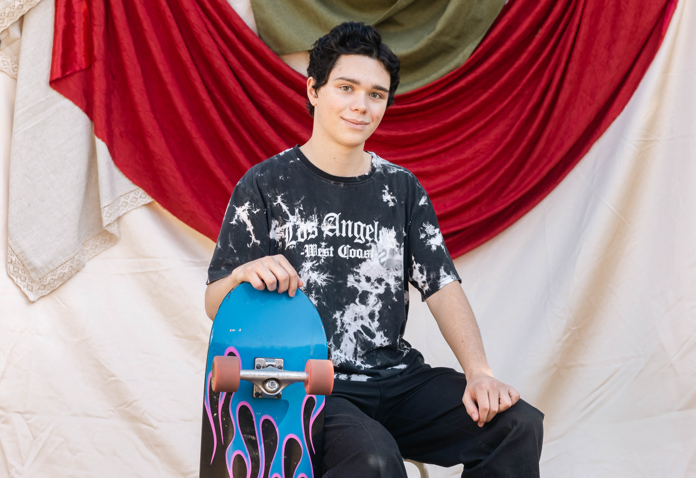

[Back to main page](README.md)
# Dresden

My name's Dresden. I'm from Denver, and I've lived in Colorado my entire life. I'm currently pursuing an undergrad degree in computer science at CU Boulder. 

### Interests/Experiences

- I've been skateboarding since a very young age, and so that's been a pretty big part of my life.
- I've been interested in computers and programming since I was little, and so I've been pursing computer science to some degree for a long time. 
- More recently (in the past 5 years), I got interested in digital art and learned tools like Blender and Davinci Resolve. 
- I competed on my high school's robotics team, which is when I actually started learning how to program.

# Pictures

